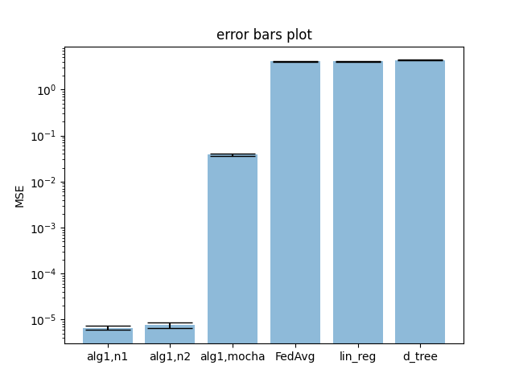

# SBM_experiment_two_cluster
## Error Bar
Stay with sampling_rate = 0.6
### K=2000
```
algorithm 1, norm1: 
 mean train MSE: 6.659971139038517e-06 
 mean test MSE: 6.876555003132758e-06
algorithm 1, norm2: 
 mean train MSE: 6.765699177490366e-06 
 mean test MSE: 6.863383807011273e-06
algorithm 1, mocha: 
 mean train MSE: 0.0009798109284494226 
 mean test MSE: 0.06565751882208315
federated learning: 
 mean train MSE: 4.071821270534407 
 mean test MSE: 4.172718288248317
linear regression: 
 mean train MSE: 3.9616607746634087 
 mean test MSE: 4.122854979575622
decision tree: 
 mean train MSE: 4.1455853465807815 
 mean test MSE: 4.73465196217315
```


### K=1000
```
algorithm 1, norm1: 
 mean train MSE: 7.186676723822663e-06 
 mean test MSE: 7.4506596263593795e-06
algorithm 1, norm2: 
 mean train MSE: 7.638455802250581e-06 
 mean test MSE: 9.050275309112547e-06
algorithm 1, mocha: 
 mean train MSE: 0.0009280453118299838 
 mean test MSE: 0.06340326428034622
federated learning: 
 mean train MSE: 4.058159829154424 
 mean test MSE: 4.151101841823264
linear regression: 
 mean train MSE: 3.92215887779226 
 mean test MSE: 3.949852195218655
decision tree: 
 mean train MSE: 3.925361572117521 
 mean test MSE: 4.343146415238957
```


### K=100
```
algorithm 1, norm1: 
 mean train MSE: 0.00448717834220243 
 mean test MSE: 5.133386689756778
algorithm 1, norm2: 
 mean train MSE: 0.002386102159392071 
 mean test MSE: 5.716554335362867
algorithm 1, mocha: 
 mean train MSE: 0.016062417839596565 
 mean test MSE: 1.7111590620193684
federated learning: 
 mean train MSE: 3.847687281043293 
 mean test MSE: 4.059644800827426
linear regression: 
 mean train MSE: 3.7438813208211927 
 mean test MSE: 4.076528222274301
decision tree: 
 mean train MSE: 3.8737259698002036 
 mean test MSE: 4.380788559514036
```


## Penalty Function
### K=2000
#### norm1
```
penalty_func: norm1
M: 0.2
 MSEs_mean: {0.01: 2.958735522492587e-05, 0.05: 0.1194559530739967, 0.1: 3.3937054454975986, 0.15: 3.308141618820251, 0.2: 3.555617786180845, 0.25: 3.2767989484038993, 0.3: 3.598635441417933, 0.4: 3.37988864927199, 0.5: 3.5389892505964573, 0.6: 3.627264934284922}
 MSEs_std: {0.01: 4.337632077887632e-06, 0.05: 0.0343589638762547, 0.1: 0.08566246618443814, 0.15: 0.3402227098356647, 0.2: 0.39411340510453535, 0.25: 0.24273426917365895, 0.3: 0.38636943643726807, 0.4: 0.2381354366301481, 0.5: 0.4903985432731925, 0.6: 0.29077581663983576}
M: 0.4
 MSEs_mean: {0.01: 7.102524530291397e-06, 0.05: 0.000154078114462334, 0.1: 0.0006207997842140078, 0.15: 0.22436132950887258, 0.2: 2.6257931109285133, 0.25: 2.6608832457673244, 0.3: 2.8821932594588686, 0.4: 2.581380948726264, 0.5: 2.8279142157288053, 0.6: 2.7948618652054185}
 MSEs_std: {0.01: 1.495559104508231e-06, 0.05: 2.6230957595684935e-05, 0.1: 6.688544884945041e-05, 0.15: 0.059531367999503135, 0.2: 0.20308100152584668, 0.25: 0.27962519652831413, 0.3: 0.39616429645865153, 0.4: 0.23450963654625356, 0.5: 0.3976302276334751, 0.6: 0.36767645028419305}
M: 0.6
 MSEs_mean: {0.01: 3.044217359193656e-06, 0.05: 6.6720254646686e-05, 0.1: 0.00026753102607954455, 0.15: 0.0005690519075226593, 0.2: 0.00989659570175035, 0.25: 0.2520299174797652, 0.3: 1.4993752185425029, 0.4: 1.7753265001937184, 0.5: 1.8706502546177852, 0.6: 1.7041332587935962}
 MSEs_std: {0.01: 2.453216918172619e-07, 0.05: 4.557554017907675e-06, 0.1: 3.4889766772876215e-05, 0.15: 5.2499714895014274e-05, 0.2: 0.017435092636572558, 0.25: 0.11348288563332372, 0.3: 0.1852851268333664, 0.4: 0.15345188625520367, 0.5: 0.32720739577450064, 0.6: 0.1742130438186501}
 ```
 

 #### norm2
 ```
 penalty_func: norm2
M: 0.2
 MSEs_mean: {0.01: 0.004397002675228709, 0.05: 0.5168969219216782, 0.1: 3.3200613438055186, 0.15: 3.4852525758498887, 0.2: 3.7210974866846476, 0.25: 3.5604454159073327, 0.3: 3.349616631743241, 0.4: 3.497574697090873, 0.5: 3.6820840904236602, 0.6: 3.2467471391516547}
 MSEs_std: {0.01: 0.007916672856507928, 0.05: 0.11902013217236021, 0.1: 0.18410738251207664, 0.15: 0.4096926025088516, 0.2: 0.35238819063949506, 0.25: 0.20843900278595387, 0.3: 0.27041499825114457, 0.4: 0.27563587261494854, 0.5: 0.44768209755966015, 0.6: 0.11078097366486245}
M: 0.4
 MSEs_mean: {0.01: 7.871289175014592e-06, 0.05: 0.00015270425294931867, 0.1: 0.0006858952633718123, 0.15: 0.5184200952526524, 0.2: 2.430169622881921, 0.25: 2.8924524985698072, 0.3: 2.459750956460886, 0.4: 2.6121139524006667, 0.5: 2.520642087878345, 0.6: 2.9000059250618575}
 MSEs_std: {0.01: 1.0828972898096198e-06, 0.05: 2.4991769685474056e-05, 0.1: 0.00013583916957266059, 0.15: 0.09285926707626782, 0.2: 0.21739897597560498, 0.25: 0.40106903687504913, 0.3: 0.0688390000324632, 0.4: 0.26514896451090875, 0.5: 0.2606485281916742, 0.6: 0.4728792676405088}
M: 0.6
 MSEs_mean: {0.01: 3.4549787147910115e-06, 0.05: 6.272704704907836e-05, 0.1: 0.00027097554099744255, 0.15: 0.0006009450500747615, 0.2: 0.019007082980222502, 0.25: 0.3777763990022362, 0.3: 1.887893241007371, 0.4: 1.7908869936450311, 0.5: 1.7451567045993717, 0.6: 2.2265853451388056}
 MSEs_std: {0.01: 5.704588412211964e-07, 0.05: 2.1747230614864813e-06, 0.1: 2.1304184874430294e-05, 0.15: 0.00010216176939508432, 0.2: 0.025285218832188355, 0.25: 0.13058632013664465, 0.3: 0.4906954211298918, 0.4: 0.2700163500694947, 0.5: 0.18834266275032138, 0.6: 0.3735363884156735}
 ```


#### mocha
```
penalty_func: mocha
M: 0.2
 MSEs_mean: {0.01: 0.3338722627725496, 0.05: 1.140683381254258, 0.1: 2.0379861117427724, 0.15: 2.2835238165618614, 0.2: 2.6743263796785075, 0.25: 2.746032776017132, 0.3: 2.954695734711237, 0.4: 3.245969698140442, 0.5: 3.7095432341681613, 0.6: 3.716933790179475}
 MSEs_std: {0.01: 0.06839849192431399, 0.05: 0.09724590854548436, 0.1: 0.23783905150903267, 0.15: 0.05241464194994329, 0.2: 0.130636958856457, 0.25: 0.10556921153883209, 0.3: 0.1976657574667607, 0.4: 0.2678056112495187, 0.5: 0.3130283956195832, 0.6: 0.18709895562494833}
M: 0.4
 MSEs_mean: {0.01: 0.041423445267895015, 0.05: 0.3629920139844517, 0.1: 0.8185504282397321, 0.15: 1.1958263575371615, 0.2: 1.5332891947379785, 0.25: 1.7200368846642302, 0.3: 1.9581695202250315, 0.4: 2.3263259816239588, 0.5: 2.497173105049812, 0.6: 2.6911120660936296}
 MSEs_std: {0.01: 0.002890082070746284, 0.05: 0.03307556389084374, 0.1: 0.08106858203195086, 0.15: 0.0332740206083904, 0.2: 0.04927750679748773, 0.25: 0.11012765891969287, 0.3: 0.10168790285088596, 0.4: 0.14990940988601054, 0.5: 0.20032633157126917, 0.6: 0.19635936926654585}
M: 0.6
 MSEs_mean: {0.01: 0.01085077045469874, 0.05: 0.15504130959069967, 0.1: 0.3564952112622338, 0.15: 0.5883410198115835, 0.2: 0.7922273972427735, 0.25: 0.9912458741250314, 0.3: 1.1954374557796172, 0.4: 1.4323730633415228, 0.5: 1.7047841502612695, 0.6: 1.8382814876869638}
 MSEs_std: {0.01: 0.000984949681119398, 0.05: 0.005066687934050591, 0.1: 0.019475887165869378, 0.15: 0.04333908721256846, 0.2: 0.08308766621051139, 0.25: 0.06289503812966844, 0.3: 0.07755643323814157, 0.4: 0.09609136596525854, 0.5: 0.09052504969924575, 0.6: 0.04008869666141945}
```


### K=1000
#### norm1
```
penalty_func: norm1
M: 0.2
 MSEs_mean: {0.01: 0.15459049906507363, 0.05: 1.1308598744344895, 0.1: 3.3347025920465994, 0.15: 3.2484563960728905, 0.2: 3.156909816317935, 0.25: 3.4150989674136056, 0.3: 3.3583180724127537, 0.4: 3.4677958493895233, 0.5: 3.2544955156867394, 0.6: 3.31920818910286}
 MSEs_std: {0.01: 0.1326469676768711, 0.05: 0.08741258700309136, 0.1: 0.19835658397172573, 0.15: 0.10111452812400738, 0.2: 0.17987012830794574, 0.25: 0.15658636826539982, 0.3: 0.19485238133100635, 0.4: 0.20662519915850908, 0.5: 0.09081767869809912, 0.6: 0.20521903769874053}
M: 0.4
 MSEs_mean: {0.01: 6.323613888040728e-06, 0.05: 0.00014940853017150117, 0.1: 0.12314519066261184, 0.15: 0.9620173606956491, 0.2: 2.4079781154542204, 0.25: 2.489375262432807, 0.3: 2.554824415818197, 0.4: 2.5407077540154286, 0.5: 2.5486651097157664, 0.6: 2.579811560289021}
 MSEs_std: {0.01: 5.705437800642661e-07, 0.05: 1.9052635620357017e-05, 0.1: 0.06862957547480382, 0.15: 0.09905639530618761, 0.2: 0.19965276655089395, 0.25: 0.24769938715106055, 0.3: 0.09392322435881423, 0.4: 0.35767195266652796, 0.5: 0.16398487296073536, 0.6: 0.16714280586539046}
M: 0.6
 MSEs_mean: {0.01: 3.358953192373806e-06, 0.05: 7.007713491266677e-05, 0.1: 0.0002754813792231471, 0.15: 0.0011403926465636265, 0.2: 0.18678734151431448, 0.25: 0.7946946825712191, 0.3: 1.5599403156112925, 0.4: 1.7025125612225398, 0.5: 1.8291478873064704, 0.6: 1.7142027815527434}
 MSEs_std: {0.01: 4.998783403504308e-07, 0.05: 4.854624909229845e-06, 0.1: 2.2924712449700075e-05, 0.15: 0.0010274400286019152, 0.2: 0.04570157264197452, 0.25: 0.10468343513957072, 0.3: 0.12859114553373668, 0.4: 0.10862434466248222, 0.5: 0.2237755703940708, 0.6: 0.07796599625444317}
```


#### norm2
```
penalty_func: norm2
M: 0.2
 MSEs_mean: {0.01: 0.8290401525525788, 0.05: 2.3324083059014717, 0.1: 3.9344159608563274, 0.15: 3.858566783524985, 0.2: 3.7876651728353536, 0.25: 3.885834785257336, 0.3: 3.856400155955941, 0.4: 3.7085782465743784, 0.5: 3.8039778204912595, 0.6: 3.852860588398064}
 MSEs_std: {0.01: 0.04065708263162364, 0.05: 0.10039941331348734, 0.1: 0.15917396429957267, 0.15: 0.11002546149047472, 0.2: 0.17955223618569088, 0.25: 0.1416120973093325, 0.3: 0.24112785375189563, 0.4: 0.1808595504311376, 0.5: 0.14273170198806018, 0.6: 0.03654415509878092}
M: 0.4
 MSEs_mean: {0.01: 7.251186476392606e-06, 0.05: 0.005464494447578023, 0.1: 0.430350314960566, 0.15: 1.6800893876862815, 0.2: 2.459842191197817, 0.25: 2.687153482265292, 0.3: 2.6690711829890943, 0.4: 2.650721767835904, 0.5: 2.4719959090017243, 0.6: 2.5675474326224887}
 MSEs_std: {0.01: 1.0708091320960733e-06, 0.05: 0.00923912738094863, 0.1: 0.09467714844132423, 0.15: 0.2486025326075932, 0.2: 0.13975919428583022, 0.25: 0.25420398139245093, 0.3: 0.12102926544479511, 0.4: 0.18905375306932296, 0.5: 0.1909756486379047, 0.6: 0.180119506573739}
M: 0.6
 MSEs_mean: {0.01: 2.8671311022121042e-06, 0.05: 6.884623082098742e-05, 0.1: 0.0002596476183559645, 0.15: 0.016901065165715275, 0.2: 0.31466893312076205, 0.25: 0.9710490957224529, 0.3: 1.554188846310817, 0.4: 1.8011624147428917, 0.5: 1.6372786682082268, 0.6: 1.6669948014992895}
 MSEs_std: {0.01: 2.950742538293258e-07, 0.05: 9.561755662644807e-06, 0.1: 3.143410111341798e-05, 0.15: 0.010397086468752287, 0.2: 0.037741392285955425, 0.25: 0.1204351877798866, 0.3: 0.05754040729863684, 0.4: 0.22133606503692302, 0.5: 0.08844265690228854, 0.6: 0.17627728758664885}
```


#### mocha
```
penalty_func: mocha
M: 0.2
 MSEs_mean: {0.01: 1.2436793005003306, 0.05: 1.777761194345467, 0.1: 2.334661677931476, 0.15: 2.654170193704185, 0.2: 3.035077633416537, 0.25: 3.2870939265179677, 0.3: 3.4190537593075327, 0.4: 3.7231494146972195, 0.5: 3.7635387703015923, 0.6: 3.814381936782661}
 MSEs_std: {0.01: 0.14095031521822124, 0.05: 0.1273193720733967, 0.1: 0.07333609065707171, 0.15: 0.12278537688768464, 0.2: 0.1683825684416904, 0.25: 0.11524878104448268, 0.3: 0.113743255005246, 0.4: 0.13857254406300867, 0.5: 0.18157044376360612, 0.6: 0.13260879663899047}
M: 0.4
 MSEs_mean: {0.01: 0.18044941496051714, 0.05: 0.5288385852584124, 0.1: 0.9213973870729418, 0.15: 1.3251854259239515, 0.2: 1.5710454113968626, 0.25: 1.9024078670282374, 0.3: 1.901258117152193, 0.4: 2.247474634307071, 0.5: 2.5853564245492966, 0.6: 2.630125641945338}
 MSEs_std: {0.01: 0.01612076084839327, 0.05: 0.04544167382681984, 0.1: 0.05791133662114584, 0.15: 0.05450361557779752, 0.2: 0.06382474368393742, 0.25: 0.0727842311839621, 0.3: 0.051489727290074866, 0.4: 0.16351087747526644, 0.5: 0.11470528666126042, 0.6: 0.19796191279524358}
M: 0.6
 MSEs_mean: {0.01: 0.03223136447912798, 0.05: 0.16910154713346182, 0.1: 0.4223126817942262, 0.15: 0.6118239127036466, 0.2: 0.830881754788664, 0.25: 1.057524834728764, 0.3: 1.1491108713638136, 0.4: 1.4400512159626808, 0.5: 1.7023055778012868, 0.6: 1.8757251175447567}
 MSEs_std: {0.01: 0.0009779665878582701, 0.05: 0.014376584201397754, 0.1: 0.03017141850608496, 0.15: 0.04248156298034468, 0.2: 0.06392847378049574, 0.25: 0.04627280131158654, 0.3: 0.0768593357630275, 0.4: 0.11878815348839551, 0.5: 0.12531245195221852, 0.6: 0.14457529179369638}
```

